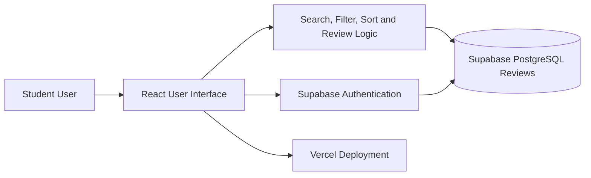
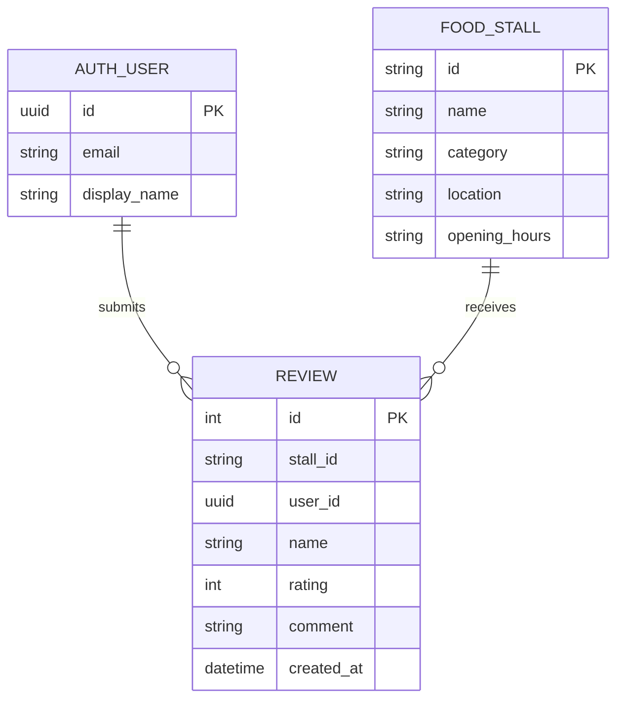

# CampusBite – Campus Food Review and Discovery Platform

## 1. Project Overview

CampusBite is a web-based campus food discovery and review platform developed for university students. It provides one place where users can browse campus food stalls, search and filter options, compare menus and prices, check opening hours and locations, read reviews, create an account, log in, and submit authenticated reviews.

The project addresses the problem of scattered and unreliable campus food information. By combining stall information and student feedback in one responsive platform, CampusBite helps students make faster and better-informed dining decisions.

## 2. Project Links

- **GitHub Repository:** https://github.com/BaoJiatao/campus-food-review-website-pc3
- **Deployed Website:** https://campus-food-review-website-pc3.vercel.app

## 3. Team Members

| Name | Role |
|---|---|
| Bao Jiatao | Project Lead / Developer |
| Lin Yan | Frontend Developer / UI/UX Designer |

## 4. Project Objectives

- Create a central and reliable platform for campus food discovery.
- Help students compare stalls, menus, prices, ratings and reviews.
- Reduce the time students spend searching for campus food information.
- Provide a clear feedback channel between students and food vendors.
- Apply agile and iterative software engineering practices.
- Deliver a working web application with a modern GUI, database and cloud deployment.

## 5. Target Users and User Needs

The main target users are university students who regularly eat on campus. Interviews and informal feedback identified the following needs:

- Food stall information should be easy to find.
- Menus, prices, locations and opening hours should be clearly displayed.
- Search, category filtering and sorting should help users compare options quickly.
- Ratings and peer reviews should support dining decisions.
- Review submissions should be linked to authenticated users.
- The interface should work on desktop and mobile screen sizes.

## 6. Requirements and User Stories

| No. | User Story | Priority | Estimated Effort | Final Status |
|---:|---|---:|---:|---|
| 1 | As a student, I want to browse all campus food stalls so that I can discover available options. | 10 | 2 days | Completed |
| 2 | As a student, I want to view stall details, including menu, prices, location and opening hours. | 10 | 3 days | Completed |
| 3 | As a student, I want to search food stalls by name or cuisine type so that I can find food quickly. | 20 | 2 days | Completed |
| 4 | As a student, I want to filter and sort stalls so that I can compare suitable options efficiently. | 20 | 2 days | Completed |
| 5 | As a student, I want to view ratings and reviews so that I can assess food quality. | 20 | 3 days | Completed |
| 6 | As a student, I want to register and log in so that my review activity can be associated with my account. | 30 | 3 days | Completed |
| 7 | As a logged-in student, I want to submit a star rating and written review so that I can share my experience. | 30 | 4 days | Completed |
| 8 | As a student, I want the website to work on different screen sizes so that I can use it on desktop or mobile. | 30 | 3 days | Completed |
| 9 | As a student, I want to upload food photos and save favourite stalls. | 40 | 5 days | Future Work |
| 10 | As an administrator or vendor, I want to manage stall information and moderate reviews. | 50 | 5 days | Future Work |

The implementation order was based on user value, technical dependencies, development risk and available time. Core browsing and stall information were completed first, followed by search, filtering, sorting, reviews, authentication, database persistence, testing and final refinement.

### 6.1 Acceptance and Quality Criteria

The main acceptance criteria were:

- All stall cards load without layout errors.
- Search is case-insensitive and returns matching stalls.
- Category filters and sorting options update the displayed list correctly.
- Stall details display the correct menu, prices, location and opening hours.
- Users can register, log in and log out through Supabase Authentication.
- Only authenticated users can submit reviews.
- Valid reviews are stored in Supabase and displayed for the correct stall.
- Empty review comments are rejected.
- The deployed website remains usable on desktop and mobile screen sizes.

## 7. Final Implemented Features

The final CampusBite system includes:

- Browse six campus food stalls.
- View stall names, categories, descriptions, ratings and price ranges.
- Open detailed stall information.
- View menus, prices, opening hours and locations.
- Search by stall name, cuisine type, location or price range.
- Filter stalls by category.
- Sort stalls by rating or starting price.
- Clear search, category and sorting selections.
- View existing and submitted reviews.
- Register, log in and log out using Supabase Authentication.
- Require authentication before review submission.
- Store submitted reviews in Supabase PostgreSQL.
- Retrieve and display reviews from Supabase.
- Validate empty comments and authentication state.
- Use a responsive interface on desktop and mobile screen sizes.
- Deploy the final React application through Vercel.

## 8. System Design

### 8.1 Architecture Design

CampusBite uses a client–cloud architecture:

1. **Presentation layer:** React components display the navigation, stall cards, search controls, category filters, sorting controls, authentication modal, stall details and review form.
2. **Application layer:** JavaScript and React state manage searching, filtering, sorting, modal interaction, authentication state, validation and review updates.
3. **Data and authentication layer:** Supabase Authentication manages user sessions, while Supabase PostgreSQL stores persistent review records.
4. **Deployment layer:** Vercel hosts the production build created by Vite.


```mermaid
flowchart LR
    U[Student User] --> UI[React User Interface]
    UI --> A[Search, Filter, Sort and Review Logic]
    UI --> AUTH[Supabase Authentication]
    A --> DB[(Supabase PostgreSQL Reviews)]
    AUTH --> DB
    UI --> V[Vercel Deployment]
```

### 8.2 Main Components

- **App:** Coordinates stall data, filtering, sorting, selected-stall state, review loading and review submission.
- **MockLogin:** Despite its original development name, the final component uses Supabase Authentication for registration, login, session tracking and logout.
- **Stall Cards:** Display summary information and provide access to stall details.
- **Search and Category Controls:** Narrow the displayed stall list.
- **Sorting Control:** Orders stalls by rating or price.
- **Stall Detail Section:** Displays menus, prices, opening hours, ratings and reviews.
- **Review Form:** Validates and submits authenticated reviews.
- **Supabase Client:** Connects the React application to authentication and database services.

The design separates user-interface responsibilities from authentication and database access. Reusable rendering patterns and shared styles reduce duplication and support maintainability.

### 8.3 Class Diagram


### 8.4 Sequence Diagram

The sequence diagram shows how a student searches for a stall and opens its detailed information.


### 8.5 Interface Design

The interface follows a single-page layout with clear sections for discovery, comparison and review submission. The design uses:

- A prominent search area for quick discovery.
- Category buttons and sorting controls for comparison.
- Consistent stall cards for visual scanning.
- A focused detail section for menu and review information.
- A modal-style authentication interface.
- Responsive CSS for smaller screens.

The deployed website acts as the final interactive interface prototype and demonstrates the completed user flow.

### 8.6 Database Design

The final version uses Supabase, which provides a hosted PostgreSQL database and authentication service.

#### Reviews Table

| Column | Purpose |
|---|---|
| `id` | Unique identifier for each review |
| `stall_id` | Identifies the related food stall |
| `user_id` | Stores the authenticated Supabase user ID |
| `name` | Stores the user display name |
| `rating` | Stores the numeric rating |
| `comment` | Stores the written review |
| `created_at` | Stores the review creation time |


```mermaid
erDiagram
    AUTH_USER ||--o{ REVIEW : submits
    FOOD_STALL ||--o{ REVIEW : receives

    AUTH_USER {
        uuid id PK
        string email
        string display_name
    }

    FOOD_STALL {
        string id PK
        string name
        string category
        string location
        string opening_hours
    }

    REVIEW {
        int id PK
        string stall_id
        uuid user_id
        string name
        int rating
        string comment
        datetime created_at
    }
```

Food stall information is currently maintained in the frontend data structure, while user accounts and submitted reviews are managed through Supabase. Reviews are associated with stalls through `stall_id` and with authenticated users through `user_id`.

### 8.7 Non-Functional Requirements and Trade-offs

| Area | Design Decision |
|---|---|
| Usability | Clear search, filters, sorting, consistent cards and focused details reduce user effort. |
| Responsiveness | CSS adapts the layout for desktop and mobile screen sizes. |
| Reliability | Reviews are stored in a cloud database instead of browser-only storage. |
| Security | Supabase Authentication is required before a review can be submitted. |
| Maintainability | React, reusable logic, Git version control and automated tests support future changes. |
| Performance | Client-side filtering and Vite production builds keep interactions fast for the current dataset. |

The team selected Supabase instead of building a custom server because it provided authentication and relational database services within the project schedule. Stall data remained in the frontend to control scope, while reviews were prioritised for persistent storage. This reduced development risk but means future versions should migrate stalls and menus into database tables.

## 9. Technology Stack and Development Tools

| Area | Technology / Tool | Use in the Project |
|---|---|---|
| Frontend | React | Builds the user interface and manages application state |
| Build Tool | Vite | Runs development, testing integration and production builds |
| Programming | JavaScript, HTML and CSS | Implements logic, structure and styling |
| Authentication | Supabase Authentication | Manages registration, login, sessions and logout |
| Database | Supabase PostgreSQL | Stores and retrieves review data |
| Database Client | `@supabase/supabase-js` | Connects React to Supabase services |
| Automated Testing | Vitest | Runs automated tests |
| UI Testing | React Testing Library and User Event | Tests user interactions and rendered output |
| Static Analysis | ESLint | Checks JavaScript and React code quality |
| Version Control | Git and GitHub | Tracks changes and team contributions |
| Project Management | GitHub Issues and GitHub Projects | Tracks user stories, tasks, bugs and progress |
| Deployment | Vercel | Hosts the deployed production website |
| Design Documentation | UML, sequence and ER diagrams | Documents structure and interaction |

## 10. Agile Development Process

The project was completed through three main iterations.

### Iteration 1 – Core MVP

Main focus:

- Browse food stalls.
- View stall details.
- Create the initial interface.
- Set up the repository and Project Board.
- Create the first class and sequence diagrams.

**Planned effort:** 8 working days  
**Completed effort:** Approximately 5 working days

The unfinished ratings and reviews work was moved into Iteration 2.


### Iteration 2 – Interaction and Automated Testing

Main focus:

- Search food stalls.
- Filter stalls by category.
- Sort and reset the stall list.
- Improve stall details and responsive layout.
- Add ratings and review interaction.
- Implement 15 automated tests using Vitest and React Testing Library.
- Practise branch, pull-request and review workflow.

**Planned velocity:** 100%  
**Actual velocity:** Approximately 95–100%


### Iteration 3 – Authentication, Database and Final Delivery

Main focus:

- Integrate Supabase Authentication.
- Integrate Supabase PostgreSQL review storage.
- Link reviews to authenticated users.
- Validate review comments and login state.
- Track and resolve interface defects.
- Conduct final system and regression testing.
- Refine documentation and deployment configuration.
- Prepare the final demonstration and report.

Iteration 3 focused on reliability, persistence and completion rather than adding low-priority features.

### 10.1 Feedback and Response

| Stage | Feedback or Finding | Team Response |
|---|---|---|
| Iteration 1 | Students needed clearer and faster access to detailed stall information. | The team improved stall cards and the detail view. |
| Iteration 2 | Search, comparison and testing evidence needed to be strengthened. | The team added filtering, sorting, review interaction and 15 automated tests. |
| Iteration 3 | The final system required persistent data rather than frontend-only review storage. | The team integrated Supabase Authentication and PostgreSQL review storage. |

## 11. Testing and Verification Strategy

The project used automated component testing, manual functional testing, system testing and regression testing.

### 11.1 Automated Tests

The repository contains 15 automated tests organised around five user-story areas:

| Test Group | Test Cases | Scope |
|---|---:|---|
| Search | TC01–TC03 | Full-name, partial-name and case-insensitive search |
| Category Filter | TC04–TC06 | Category selection, category changes and reset |
| Stall Details | TC07–TC09 | Open details, display menu/prices and close details |
| Sort and Reset | TC10–TC12 | Rating sort, price sort and clear selections |
| Review Interaction | TC13–TC15 | Named review, anonymous fallback in the earlier interaction design, and empty-comment validation |

The automated suite was created before the final Supabase authentication change. Therefore, the latest authenticated review and database workflow was additionally verified through manual system testing. Updating the review tests to mock the current Supabase session is identified as a maintenance improvement.

### 11.2 Manual and System Testing

Manual tests checked that users could:

- Browse all stalls.
- Search, filter, sort and reset the stall list.
- Open and close stall details.
- View menu, price, opening-hour and location information.
- Register a user account.
- Log in and log out.
- Receive an error when attempting to submit a review without logging in.
- Submit a valid authenticated review.
- Retrieve stored reviews after page reload.
- Receive validation feedback for an empty comment.
- Use the deployed interface on desktop and mobile screen sizes.

### 11.3 Database and Authentication Testing

Database and authentication testing checked that:

- Supabase registration creates a user account.
- Valid credentials create a logged-in session.
- Logout clears the session.
- Unauthenticated review submission is rejected.
- A valid review is inserted into the `reviews` table.
- The review contains the correct `stall_id` and authenticated `user_id`.
- Stored reviews are retrieved and displayed for the correct stall.
- Database or authentication errors are handled without crashing the interface.

### 11.4 Final Test Record

| Area | Test Method | Recorded Result |
|---|---|---|
| Stall browsing | Automated and manual | Passed |
| Search | Automated and manual | Passed |
| Category filtering | Automated and manual | Passed |
| Sorting and reset | Automated and manual | Passed |
| Stall details | Automated and manual | Passed |
| Empty-comment validation | Automated and manual | Passed |
| Registration, login and logout | Manual system test | Passed |
| Authenticated review submission | Manual system test | Passed |
| Supabase review persistence | Manual database test | Passed |
| Responsive layout | Manual desktop/mobile test | Passed |
| Vercel deployment | Manual production check | Passed |

## 12. Bug Tracking and Resolution

GitHub Issues and the GitHub Project Board were used to record and manage user stories and defects. Each bug record included the problem description, reproduction information, expected result, actual result, related feature and status.

The workflow used was:

**To Do → In Progress → In Review → Done**

One documented interface defect involved the vertical position of the login modal. The layout was adjusted and committed after review. Additional final checks covered search behaviour, filtering, stall details, authenticated review submission, responsive layout and documentation consistency.

## 13. Version Control and Collaboration

Git and GitHub were used throughout the development process. Evidence in the repository includes:

- Regular commits from team members.
- A separate practical branch for feature and pull-request practice.
- A merged pull request demonstrating the review and merge process.
- GitHub Issues for user stories and testing tasks.
- Labels for progress and completion status.
- A GitHub Project Board for iteration tracking.
- Commit history showing testing, UI, authentication, database and documentation work.
- Repository access for the course instructor.

The instructor, **Dasheng LIU**, was added as a project member so that the repository and project evidence could be reviewed.

## 14. Local Setup and Verification

From the repository root:

```bash
cd client
npm install
npm run dev
```

The Supabase environment variables must be configured locally or in Vercel without committing secret values:

```text
VITE_SUPABASE_URL=your_supabase_project_url
VITE_SUPABASE_ANON_KEY=your_supabase_anon_key
```

Run automated tests and a production build with:

```bash
npm run test:run
npm run lint
npm run build
```

## 15. Final Project Status

CampusBite satisfies the main project requirements by providing:

- A software application with source code.
- A modern graphical user interface.
- Supabase Authentication for user accounts and sessions.
- A relational cloud database for persistent reviews.
- A deployed and accessible web application.
- Agile planning and iteration evidence.
- Automated and manual testing evidence.
- Bug tracking, version control and technical documentation.

The main user-value features were completed within the available project time. Lower-priority functions were moved to future work to avoid overcommitting and to protect the reliability of the delivered system.

## 16. Future Improvements

Possible future improvements include:

- Update automated review tests to mock current Supabase authentication and database calls.
- Move food stalls, menus and opening hours into Supabase tables.
- Add password reset and improved account management.
- Add food photo uploads.
- Add favourite stalls and personalised recommendations.
- Add vendor and administrator dashboards.
- Add review editing, deletion and moderation.
- Add test coverage reporting and continuous integration through GitHub Actions.

## 17. Conclusion

CampusBite delivers a working campus food discovery and review platform. The project demonstrates requirements planning, architectural and database design, React implementation, Supabase authentication and data persistence, automated and manual testing, bug tracking, version control, agile iteration and cloud deployment.

The final system allows students to discover stalls, compare information, register and log in, and submit persistent reviews through a responsive user interface.

## 18. Declaration of AI-Generated Material

Generative AI tools were used to assist with documentation structure, language editing, code explanation and troubleshooting suggestions during this project. All AI-assisted material was reviewed, adapted and verified by the team against the project source code, GitHub history, testing evidence and deployed system. The team accepts responsibility for the accuracy, quality and final submission of all project code and documentation.
